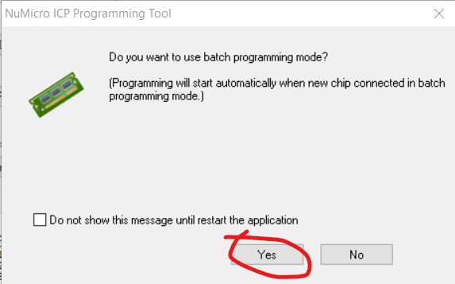

#  Geliştirme Kartı Firmware Yüklenmesi

### 1. KAPSAM

Bu döküman Geliştirme Kart'ının Debugger Bölümüne Firmware yüklenmesini anlatacaktır.

### 2. GEREKLİ ARAÇLAR

- Yazılım yükleyebilmek için Nuvoton Nu-Link serisi herhangi bir programlayıcıya ihtiyaç vardır. Buadımda Nu-Link-Pro kullanılmıştır.

- Yazılım yükleyici yazılım Windows için buradan [indirilir.](https://www.nuvoton.com/resource-download.jsp?tp_GUID=SW1720200221181328) 
- Güncel sürüm kontrolü için burası [kullanılır.](https://www.nuvoton.com/support/tool-and-software/software/programmer/?__locale=en)
- Detaylar için döküman [buarada.](https://www.nuvoton.com/export/resource-files/RH_ICP_Programming_Tools_EN_V3.08.pdf)

### 3. FIRMWARE ADIMLARI

- Cihaz Şekilde görüldüğü bağlanır.

- Windowstan Program Çalıştırılır

- İlgili ayarlar yapılır.
- LDRom Bölümüne C:\Program Files (x86)\Nuvoton Tools\ICPTool\Nu_Link\ICE_ISP_8K.bin
- APRom Bölümüne C:\Program Files (x86)\Nuvoton Tools\ICPTool\Nu_Link\NuLink1FW.bin
- Seçimleri yapılır ve Nulink Pro cihaz bağlantısı yapıldıktan sonra Connect butonu tıklanarak çip bulunur.
- 

- Start komutuyla işleme başlanır. Aşağıdaki uyarı çıkabilir.

- Yükleme işlemi Başarılı olması durumunda ekran aşağıdaki gibidir.

