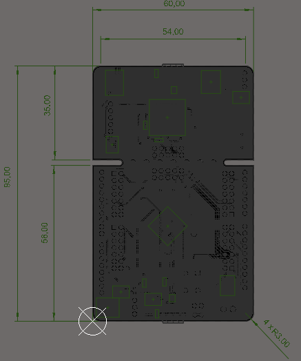
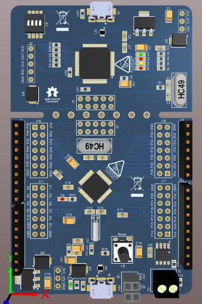
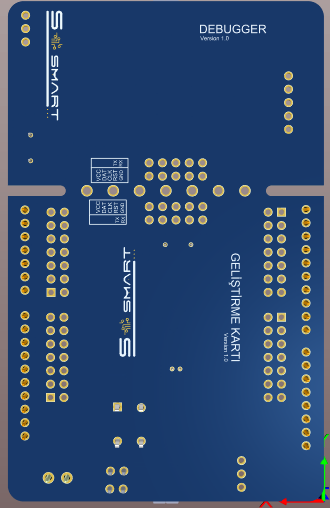
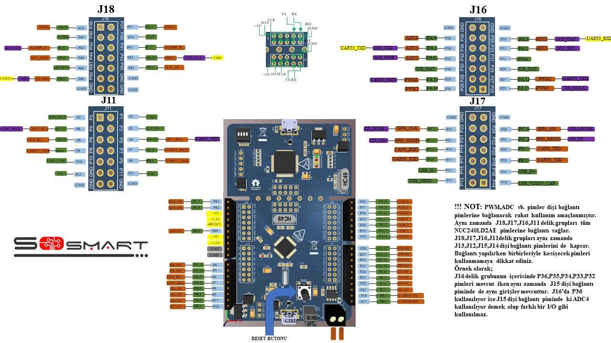

#  Geliştirme Kartı

### 1. KAPSAM

Bu döküman Geliştirme Kart'ının tanımını ve çalışma prensibini açıklar.

### 2. ÜRÜN PARAMETRELERİ

-  Çalışma Gerilimi: DC +5V
-  Çalışma Sıcaklığı:-40 ℃ ~ +105 ℃ 
-  İşlemci Mimarisi: ARM® Cortex™-M0 core
-  Çalışma Frekansı: 72MHz'e kadar çalışır.
-  Seri haberleşme : 4 adet UART 1 adet SPI 2 adet I^2C 1 adet USB 1 adet LIN 1 adet CAN
- 4 adet PWM pini
- 7 adet ADC pini
- APROM 64 KB
- RAM 8KB
- DATA FLASH 4KB
- ISP ROM 8KB
- I/O 31 adet.
- Timer (32 bit) 4 adet.
- USB ve hassas zamanlama işlemi için harici 4~24 MHz yüksek hızlı kristal osilatör.
- RTC işlevi ve düşük güç sistemi için harici 32.768 kHz düşük hızlı kristal osilatör.

### 3. MEKANİK

Pdf [DevBoard](Mechanic/DevBoard.pdf)

### 4. PİN AÇIKLAMALARI

|Pin Numarası|Pin Adı|Pin Tipi|Açıklama|
|------|------|------|------|
|1|Vbat|P|Batarya ile besleme pimi|
|2|X32_OUT|O|Harici 32.768 kHz kristal osilatör çıkış pini.|
|3|X32_IN|I|Harici 32.768 kHz kristal osilatör giriş pini.|
|4|PA.11-I2C1_SCL-CAN1_RXD|I/O-I/O-I|Genel amaçlı dijital I/O pini-I2C1 Clok pimi-CAN1 için data alıcı giriş pini|
|5|PA.10-I2C1_SDA-CAN1_TXD|I/O-I/O-O|Genel amaçlı dijital I/O pini-I2C0 Clok pimi-CAN1 için data verici çıkış pini|
|6|PA.9-I2C0_SCL|I/O-I/O|Genel amaçlı dijital I/O pini-I2C0 için clock pini|
|7|PA.8-I2C0_SDA|I/O-I/O|Genel amaçlı dijital I/O pini-I2C0 için data giriş-çıkış pini|
|8|PB.4-UART1_RXD|I/O-I|Genel amaçlı dijital I/O pini-UART1 için data alıcı pini|
|9|PB.5-UART1_TXD|I/O-O|Genel amaçlı dijital I/O pini-UART1 için data verici pini|
|10|LDO_CAP|P|LDO çıkış pini|
|11|VDD|P|I/O için güç kaynağı PLL ve dijital devre için LDO kaynağı|
|12|Vss|P|Dijital devre için topraklama pini|
|13|USB_VBUS|USB|USB HOST yada HUB için güç kaynağı|
|14|USB_Vdd33_CAP|USB|Dahili güç regülatörü çıkışı 3.3 V dekuplaj pini|
|15|USB_D-|USB|USB diferansiyel sinyali D-|
|16|USB_D+|USB|USB diferansiyel sinyali D+|
|17|PB.0-UART0_RXD|I/O-I|Genel amaçlı dijital I/O pini-UART0 için data alıcı pini|
|18|PB.1-UART0_TXD|I/O-O|Genel amaçlı dijital I/O pini-UART0 için data verici pini|
|19|PD.6-CAN0_RXD|I/O-I|Genel amaçlı dijital I/O pini-CAN0 için data alıcı pini|
|20|PD.7-CAN0_TXD|I/O-I|Genel amaçlı dijital I/O pini-CAN0 için data verici pini|
|21|PC.3-SPI_MOSI0-I2S_DO|I/O-I/O-O|Genel amaçlı dijital I/O pini-1.SPI0 MOSI (Master Out, Slave In) pini-I2S data çıkışı|
|22|PC.2-SPI0_MISO0-I2S_DI|I/O-I/O-I|Genel amaçlı dijital I/O pini-1.SPI0 MISO (Master out, Slave In) pini-I2S data girişi|
|23|PC.1-SPI0_CLK-I2S_BCLK|I/O-I/O-I/O|Genel amaçlı dijital I/O pini-SPI0 seri clock pini-I2S bit clock pini|
|24|PC.0-SPI0_SS0-I2S_LRCLK|I/O-I/O-I/O|Genel amaçlı dijital I/O pini-1.SPI0 slave seçme pini-I2S sol-sağ kanal clock|
|25|PA.15-PWM3-I2S_MCLK|I/O-I/O-O|Genel amaçlı dijital I/O pini- PWM3 çıkışı-I2S master clock çıkış pini|
|26|PA.14-PWM2|I/O-I/O|Genel amaçlı dijital I/O pini- PWM2 çıkışı|
|27|PA.13-PWM1-UART5_TXD|I/O-I/O-O|Genel amaçlı dijital I/O pini-PWM1 çıkışı-UART5 için data verici pini|
|28|PA.12-PWM0-UART5_RXD|I/O-I/O-I|Genel amaçlı dijital I/O pini-PWM0 çıkışı-UART5 için data alıcı pini|
|29|ICE_DAT|I/O|Seri hata ayıklayıcı veri pini|
|30|ICE_CLK|I| Seri hata ayıklayıcı clock pini|
|31|AVss|AP|Analog devre için topraklama pini|
|32|PA.0-ADC0-SC0_PWR|I/O-AI-O|Genel amaçlı dijital I/O pini-ADC0 analog girişi-SmardCard0 güç girişi|
|33|PA.1-ADC1-SC0_RST|I/O-AI-O|Genel amaçlı dijital I/O pini-ADC1 analog girişi-SmartCard0 reset pini|
|34|PA.2-ADC2-SC0_CLK-UART3_TXD|I/O-AI-O-O|Genel amaçlı dijital I/O pini-ADC2 analog girişi-SmartCard0 clock pini-UART3 için data verici pini|
|35|PA.3-ADC3-SC0_DAT-UART3_RXD|I/O-AI-O-I|Genel amaçlı dijital I/O pini-ADC3 analog girişi|SmartCard0 veri pini|UART3 için data alıcı pini|
|36|PA.4-ADC4|I/O-AI|Genel amaçlı dijital I/O pini-ADC4 analog girişi|
|37|PA.5-ADC5|I/O-AI|Genel amaçlı dijital I/O pini-ADC5 analog girişi|
|38|PA.6-ADC6|I/O-AI|Genel amaçlı dijital I/O pini-ADC6 analog girişi|
|39|Vref|AP|ADC için voltaj referans pini|
|40|AVdd|AP|Dahili analog devre için güç kaynağı|
|41|PC.7-ACMP0_N|I/O-AI|Genel amaçlı I/O pini-Comparator0 negatif giriş pini|
|42|PC.6-ACMP0_P-SC-CD|I/O-AI-I|Genel amaçlı dijital I/O pini-Comprator0 pozitid giriş pini-SmartCard0 kart algılama pini|
|43|PB.15-INT1-TM0_EXT-TM0|I/O-I-I-O|Genel amaçlı dijital I/O pini-Harici interrupt1 giriş pini-Timer0 harici  giriş pini-TM0 geçiş çıkış pini|
|44|PF.0-XT1_OUT|I/O-O|Genel amaçlı dijital I/O pini-Harici 4~24 MHz(yüksek hızlı) kristal osilatör çıkış pini|
|45|PF.1-XT1_IN|I/O-I|Genel amaçlı dijital I/O pini- Harici 4~24 MHz(yüksel hızlı) kristal osilatör giriş pini|
|46|nRESET|I|Harici sıfırlama girişi: Active Low|
|47|PVss|P|PLL ground|
|48|PB.8-STADC-TM0-CLKO|I/O-I-I/O-O|Genel amaçlı dijital I/O pini-ADC dahili tetikleme giriş pini-Timer0 olay sayacı girişi / geçiş çıkışı- Frekans bölücü clock çıkış pini|

### 5. GELİŞTİRME KARTI PİN ŞEMASI

### 6. Devre

Sch File [DevBoard](Circuit/DevBoard.pdf) 

Bom List [BomList](Circuit/DevBoard_BomList.pdf) 

Gerber File [Gerber](Circuit/DevBoard_Gerber.zip) 

### 7. YAZILIM GÜNCELLEME

[Beni Oku](/FW.md)

### GENEL BAKIŞ 

Geliştirme Kartı çevre ile etkileşime giren sistemler yapmada, sensörlerden gelen verileri kullanarak yapılacak uygulamalarda, akıllı ev sistemleri oluşturmada, hareketli nesneler tasarlama gibi birçok alanda kullanım özelliği gösterebilir. Prototiplemeye imkan sağlaması, çeşitli devrelerde rahatça kullanılabilmesi için gerekli pinler devre kartı sayesinde dışarıya alınmıştır. Jumper kablolar ile bağlantıları yapılabilir. Mikrodenetleyici olarak NUC240LD2AE kullanılmıştır.Detaylı bilgi için linkler incelenebilir.

### Faydalı Olabilecek Linkler

[Product Page](https://www.nuvoton.com/products/microcontrollers/arm-cortex-m0-mcus/nuc140-240-connectivity-series/?tab=1)

[Product Brief](https://www.nuvoton.com/export/resource-files/NUC230_240AE_Product_Brief.pdf)

[Datasheet](https://www.nuvoton.com/export/resource-files/TRM_NUC230_240%28AE%29_Series_EN_Rev1.04.pdf)

